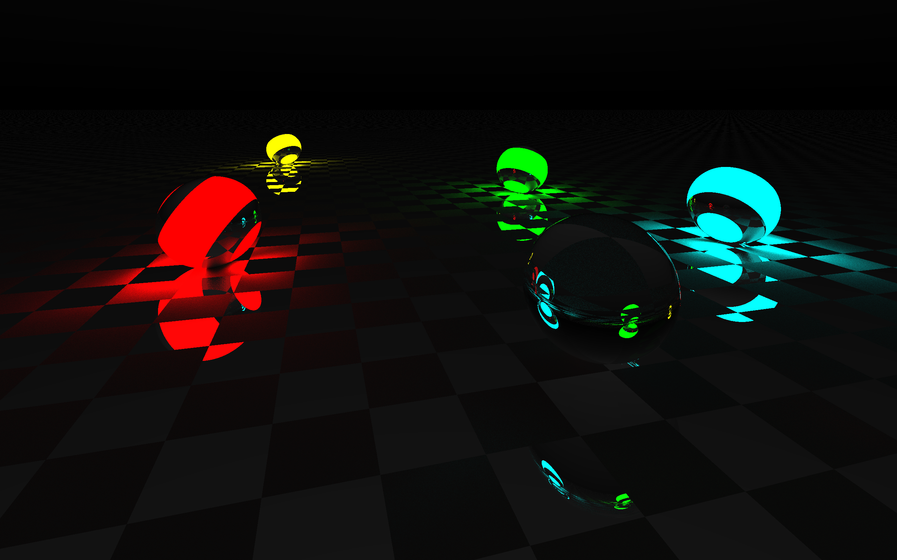

# Cpp-3D-Rendering-Project

# 3D Raytracing Engine - Object-Oriented Programming (C++)

## About the Project
This project was developed as part of the "Objektorientierte Programmierung Praktikum" (Object-Oriented Programming Lab) at the University of Duisburg-Essen (UDE). 

The goal of the project was to understand and apply complex OOP concepts by building the logic for a 3D rendering engine. Our professor provided a foundational code framework, and our team's task was to implement the missing architectural logic, fix existing bugs, and write the mathematical calculations required to successfully render the final 3D scene.

## The Challenge & Implementation
To generate the final image, we had to apply strict C++ Object-Oriented principles. This involved working with:
* **Class Inheritance & Polymorphism:** Structuring the code so that different 3D objects (like Spheres and the checkered Plane) could inherit properties from a base class.
* **Vector Mathematics:** Implementing the logic to calculate light rays, reflections, and shadow intersections in a 3D space.
* **Debugging & Code Refactoring:** Analyzing the provided base framework, finding logical errors, and patching the code to ensure the compiler could successfully generate the visual output.

## Visual Result
Because this was a university group project, the raw source code is kept private to comply with academic guidelines. However, the image below is the final, compiled output generated by our completed C++ logic. 

As you can see, the code successfully calculates multi-source lighting, smooth sphere rendering, and complex floor reflections.

---
*Note: This project demonstrates my ability to read existing codebases, understand complex OOP architectures in C++, and write functional logic to achieve a specific technical result.*
